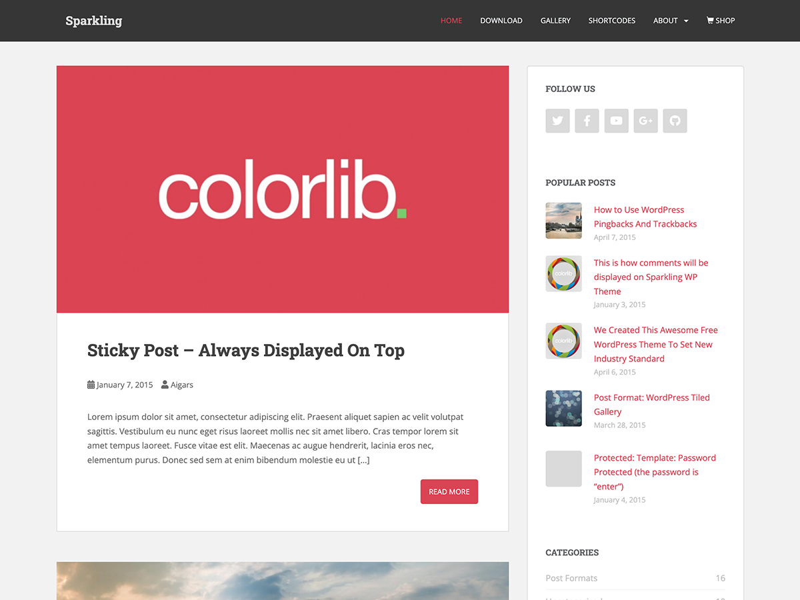

# Sparkling — Free Responsive WordPress Blog & Business Theme

[](https://github.com/ColorlibHQ/Sparkling/releases)
[](https://wordpress.org/themes/sparkling/)
[](https://www.php.net/)
[](https://www.gnu.org/licenses/gpl-2.0.html)
[](https://wordpress.org/themes/sparkling/)

**Sparkling** is a free, clean, fully responsive **WordPress theme** built on Bootstrap 3, suited to blogs,
news and magazine sites, business and portfolio sites, and WooCommerce shops. It ships a full-width slider,
four sidebar layouts, dozens of live Customizer options, and translations in over twenty languages.

[**Live demo**](https://colorlibhub.com/sparkling/) · [**Download from WordPress.org**](https://wordpress.org/themes/sparkling/) · [**Documentation**](https://colorlib.com/wp/support/sparkling/) · [**Support forum**](https://colorlib.com/wp/forums/)



---

## Contents

- [Requirements](#requirements)
- [Installation](#installation)
- [Features](#features)
- [Customizer options](#customizer-options)
- [WooCommerce](#woocommerce)
- [Translations](#translations)
- [Child themes](#child-themes)
- [Development](#development)
- [Changelog](#changelog)
- [Credits and licensing](#credits-and-licensing)

## Requirements

| | |
|---|---|
| WordPress | 6.0 or newer (tested to 7.0) |
| PHP | 7.4 or newer (tested to 8.5) |
| Browsers | All current evergreen browsers. Internet Explorer is no longer supported. |

## Installation

**From your dashboard** — go to **Appearance → Themes → Add New**, search for *Sparkling*, then click
**Install** and **Activate**.

**From a zip** — download the latest release, then **Appearance → Themes → Add New → Upload Theme**,
choose the zip and click **Install Now**.

**Manually** — unzip into `wp-content/themes/` so the theme lives at `wp-content/themes/sparkling/`,
then activate it under **Appearance → Themes**.

After activating, open **Appearance → Customize** to configure the theme, or **Appearance → About Sparkling**
for a guided setup.

## Features

- **Fully responsive** Bootstrap 3.4.1 layout, mobile and tablet friendly
- **Front page slider** — full width, pulls from any category, with captions and touch support
- **Four sidebar layouts** — right, left, none, or full width, set globally or per post, page and product
- **Live Customizer options** for colours, typography, header, footer and layout
- **Call-to-action bar** on the front page
- **Custom widgets** — social icons, popular posts, and an enhanced categories widget
- **Post formats** — aside, image, video, quote and link
- **Sticky navigation**, optional
- **Author bio box**, threaded comments and Gravatar support
- **Translation ready**, WPML compatible, with 20+ bundled translations
- **WooCommerce ready**
- **No jQuery dependency** in the theme's own JavaScript
- **Block editor support** — responsive embeds, block styles, wide blocks and an editor stylesheet
- **Accessibility touches** — skip link, visible keyboard focus, `prefers-reduced-motion` support

## Customizer options

All settings live under **Appearance → Customize → Sparkling Options**:

| Section | What it controls |
|---|---|
| Content | Post excerpts, comments on static pages |
| Slider | On/off, source category, number of slides, slide links |
| Layout | Sidebar position, element colours, WooCommerce page layout |
| Call to action | Text, button label, link, colours |
| Typography | Body font family, size, weight and colour |
| Header | Background, link and hover colours, sticky navigation |
| Footer | Background, text and link colours, social icons, custom footer text |
| Social | Social icon menu, Academicons for academic profiles |
| Archive | Custom titles for tag, category, author and date archives |

## WooCommerce

Sparkling supports WooCommerce out of the box — shop, product, cart, checkout and account pages all
inherit the theme's styling, and product galleries get zoom, lightbox and slider support.

WooCommerce pages have their own layout setting under **Layout Options**, and individual products can
override it from the layout box in the editor sidebar.

The theme overrides no WooCommerce templates, so it stays compatible as WooCommerce updates.

## Translations

Sparkling ships `.po`/`.mo` catalogues for 20+ locales in [`languages/`](languages/), plus an up-to-date
`sparkling.pot` for new translations.

Translations are also managed on
[translate.wordpress.org](https://translate.wordpress.org/projects/wp-themes/sparkling/), and language
packs from there take precedence over the bundled files.

## Child themes

Sparkling is built to be extended. Template functions are wrapped in `function_exists()` so a child theme
can redefine them, and the theme exposes filters such as `sparkling_allow_google_fonts` and
`sparkling_custom_background_args`.

If you override template files in a child theme, note that the wrapper markup is split across three files:
`header.php` opens the page containers, `sidebar.php` closes `.main-content-inner` before emitting
`#secondary`, and `footer.php` closes the rest. A template that skips `get_sidebar()` must close
`.main-content-inner` itself — see `page-fullwidth.php`.

## Development

The theme ships ready to run; there is no build step required to use it.

```bash
git clone https://github.com/ColorlibHQ/Sparkling.git
# symlink or copy into wp-content/themes/sparkling
```

`style.css` and the files in `assets/css/` are edited directly. Minified assets are committed alongside
their sources and must be regenerated by hand when the source changes:

```bash
npx terser assets/js/widget.js -c -m -o assets/js/widget.min.js
```

Bug reports and pull requests are welcome on the [issue tracker](https://github.com/ColorlibHQ/Sparkling/issues).

## Changelog

The full version history, from 1.0 in April 2014 to the current release, is in
[`changelog.txt`](changelog.txt). It is also rendered in the WordPress dashboard under
**Appearance → About Sparkling → Changelog**.

## Credits and licensing

Sparkling, Copyright 2014–2026 [Colorlib](https://colorlib.com/).
Distributed under the **GNU General Public License v2 or later** —
see [gnu.org/licenses/gpl-2.0.html](https://www.gnu.org/licenses/gpl-2.0.html).

Sparkling is based on [Underscores](https://underscores.me/), (C) 2012–2015 Automattic, Inc.,
licensed GPLv2 or later.

Bundled third-party resources:

| Resource | Version | License |
|---|---|---|
| [Bootstrap](https://getbootstrap.com/) | 3.4.1 | MIT |
| [FlexSlider](https://github.com/woocommerce/FlexSlider) | 2.7.0 | GPLv2 |
| [Font Awesome Free](https://fontawesome.com/license) | 5.1.1 | Icons CC BY 4.0, Fonts SIL OFL 1.1, Code MIT |
| [Academicons](https://jpswalsh.github.io/academicons/) | 1.8.6 | Fonts SIL OFL 1.1, Code MIT |
| [WP Bootstrap Navwalker](https://github.com/wp-bootstrap/wp-bootstrap-navwalker) | — | GPLv2 or later |

Unless otherwise noted, all images are created by Colorlib and distributed under the same license
as the theme.
